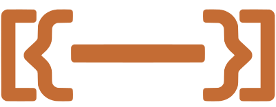

# gainSON - Open Source Workouts



Welcome to the **open source** library for workouts.
To get started go to [installation](#installation) to get a copy for yourself.

## Table of Contents

####  [Description](#description)  - Why make this? Who is it for?
####  [Installation](#installation) - How do I get this for my app?
####  [Roadmap](#roadmap) - Where is this project going?
####  [Contributors](#contributors) - Who helped out with this project?

___

### <a name="description"></a> Description

This repo is an effort for future developers to easily get a database of exercises in JSON format for any kind of development that may need it.

Developing apps is hard enough, you shouldn't waste time creating your own database of workouts. 

#### How the final product should work

[](https://mermaid-js.github.io/mermaid-live-editor/#/edit/eyJjb2RlIjoiZ3JhcGggTFIgXG5BKChTdGFydCBnYWluU09OIEFwcCkpIC0tPiBCW1NlbGVjdCBvcHRpb25zIGZvciBKU09OXVxuQiAtLT4gQ1tHZW5lcmF0ZSBGVUxMIEpTT05dXG5DIC0tPkVcbkIgLS0-IERbR2VuZXJhdGUgQ1VTVE9NIEpTT05dXG5EIC0tPiBFW1NhdmUgSlNPTiB0byBzeXN0ZW1dXG5FIC0tPiBGKChBZGQgSlNPTiB0byBBcHApKSIsIm1lcm1haWQiOnsidGhlbWUiOiJkZWZhdWx0In0sInVwZGF0ZUVkaXRvciI6ZmFsc2V9)

More features could be added, such as 
___

### <a name="installation"></a> Installation

Clone the repo:
```
Main.main()

...run it

View the JSON object in the console

(Currently working on a better way to get the JSON)
```
View the [roadmap](#roadmap) to see our plan to get to a better user experience
___

### <a name="contributors"></a> Contributors

We add devs with accepted pull requests. Also any meaningful contributions.  

<a href="https://github.com/MattiasHenders">
  
</a>

<!-- Made with [contributors-img](https://contrib.rocks) -->
___


### <a name="roadmap"></a> Roadmap

These are the goals we hope to hit mostly in order. Create an issue if you want to add to this.

**Milestones**
 - ~~Create the basic JSON object format~~
 - ~~Create the database with exercises~~
 - ~~Generate a JSON from the SQL database~~
 - Add a solid amount of exercises, most workout apps have around 100 so we hope to exceed that
 - Host the database
 - Create an executable app *.exe* 
 - Host a website for quick downloads of the full and some custom JSONs
 - Create ionic plugins that access the database directly
 - Skip the Java executable and find a good way to access the database in a meaningful way

___


## Copyright 2021 - Mattias Henders
