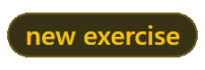

# gainSON - Open Source Workouts


Welcome to the **open source** library for workouts.
To get started go to [installation](#installation) to get a copy for yourself.

___

**To request a new exercise** to the database [click here to send a submission!](https://github.com/MattiasHenders/gainSON/wiki/Template-for-NEW-Exercise) 

> If you don't want to fill the template out just request it the same way. It just might take more time to get to.



___

## Table of Contents

####  [Description](#description)  - Why make this? Who is it for?
####  [Installation](#installation) - How do I get this for my app?
####  [Contributors](#contributors) - Who helped out with this project?
####  [Roadmap](#roadmap) - Where is this project going?

___

### <a name="description"></a> Description

This repo is an effort for future developers to easily get a database of exercises in JSON format for any kind of development that may need it.

Developing apps is hard enough, you shouldn't waste time creating your own database of workouts. Focus on your app, let this repo handle the database of exercises.
___

### <a name="installation"></a> Installation

Clone the repo:

```git clone https://github.com/MattiasHenders/gainSON.git```

Open the project in your favourite compiler:

```SaveJSONGUI.main > Run```

Run the main method and follow the GUI:

```
> Select path and file name
> Click GENERATE JSON
```

The JSON will appear in the chossen directory.

**NOTE: As there is no database hosted yet, you will be unable to generate. Getting close to that point though!**

View the [roadmap](#roadmap) to see our plan to get to a better user experience
___

### <a name="contributors"></a> Contributors

We add devs with accepted pull requests. Also any meaningful contributions.  

<a href="https://github.com/MattiasHenders">
  
</a>

<!-- Made with [contributors-img](https://contrib.rocks) -->
___


### <a name="roadmap"></a> Roadmap

These are the goals we hope to hit mostly in order. 
Create an issue if you want to add to this.

**Milestones**
 - ~~Create the basic JSON object format~~
 - ~~Create the database with exercises~~
 - ~~Generate a JSON from the SQL database~~
 - ~~Dynamically grab the columns and generate the JSON that way instead of hard coding~~
 - ~~Allow for users to select how they want their JSON to be created~~
 - ~~Allow the JSON to be saved to the computer~~
 - ~~Create a UI/Create an executable app *.exe*~~
 - Create a form for other people to submit their own exercise data
 - Add a solid amount of exercises, most workout apps have around 100 so we hope to exceed that
 - Host the database
 - Host a website for quick downloads of the full and some custom JSONs
 - Use the website to host the JSON
 - Create an API to access the JSON dynamically from apps, not from running **.exe**
___


## Copyright 2021 - Mattias Henders
